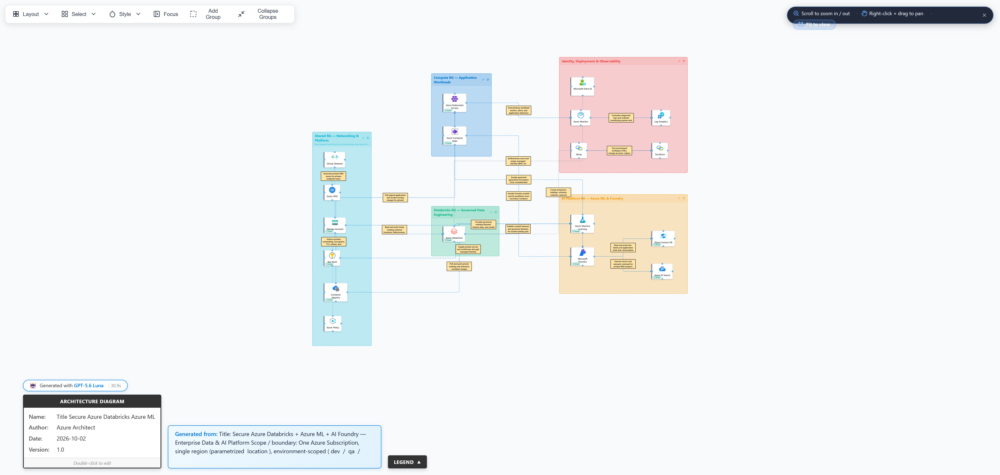

# Secure Azure Databricks with Azure ML and AI Foundry

Complete Infrastructure as Code (IaC) deployment for a secure, enterprise-grade data and AI platform on Azure.

## 🎯 Quick Start (5 Minutes)

### Prerequisites Installation (1 minute)

All prerequisites in one script - works on Windows, macOS, and Linux!

**Requirements:** PowerShell 7.0+ ([download here](https://learn.microsoft.com/powershell/scripting/install/installing-powershell))

```powershell
# Run the universal installation script
pwsh ./scripts/install-prerequisites.ps1

# Or upgrade existing tools
pwsh ./scripts/install-prerequisites.ps1 -Upgrade
```

This installs:
- ✅ Python 3.7+
- ✅ Azure CLI
- ✅ Azure Developer CLI
- ✅ Terraform
- ✅ Databricks CLI
- ✅ Required Python dependencies

### Deployment (4 minutes)

```bash
# 1. Validate deployment readiness
pwsh infra/scripts/validate.ps1

# 2. Create your parameter file from the example template
Copy-Item infra/main.example.bicepparam infra/main.bicepparam

# 3. Get your object ID for Key Vault access
az ad signed-in-user show --query id -o tsv

# 4. Edit infra/main.bicepparam and set:
#    - adminObjectId (from step 3)
#    - alertEmailAddress (for monitoring notifications)
#    Note: main.bicepparam is gitignored - safe to add your real values

# 5. Set your Databricks Account ID (one-time setup)
# Get it from: https://accounts.azuredatabricks.net
$env:DATABRICKS_ACCOUNT_ID = "your-account-id"

# 6. Deploy (Bicep + Terraform Unity Catalog automatically)
azd provision
azd deploy
```

**Total time: 15-30 minutes** (infrastructure deployment)

## 📄 Configuration Files

This project uses a **template-based configuration** pattern for security:

- **`infra/main.example.bicepparam`** - Template with placeholder values (committed to Git)
- **`infra/main.bicepparam`** - Your actual values (gitignored, never committed)

**Why this approach?**
- ✅ Prevents accidental commit of sensitive values (emails, object IDs)
- ✅ Provides clear template for all required parameters
- ✅ Safe to share repository without exposing your Azure environment details

**First-time setup:** Copy the example file and customize with your values:
```powershell
Copy-Item infra/main.example.bicepparam infra/main.bicepparam
# Then edit main.bicepparam with your adminObjectId and alertEmailAddress
```

### Documentation

**Start Here:**

- 🗺️ **[PROJECT-STRUCTURE.md](docs/PROJECT-STRUCTURE.md)** - Complete documentation map and navigation guide
- ⚡ **[QUICKSTART.md](QUICKSTART.md)** - Get started in 5 minutes
- 📋 **[DEPLOYMENT-PROCESS.md](docs/DEPLOYMENT-PROCESS.md)** - Complete deployment workflow and troubleshooting
- ✅ **[DEPLOYMENT-VALIDATION.md](docs/DEPLOYMENT-VALIDATION.md)** - Test and validate deployed infrastructure

**Terraform Guides:**

- 🏗️ **[terraform/TERRAFORM-README.md](terraform/TERRAFORM-README.md)** - Terraform structure, architecture, and quick start
- 🔍 **[terraform/INDEX.md](terraform/INDEX.md)** - Quick navigation and reference
- [Terraform Quick Start](terraform/docs/TERRAFORM-QUICK-START.md)
- [Terraform Quick Reference](terraform/docs/TERRAFORM-QUICK-REFERENCE.md)

**Module Documentation:**

- [Unity Catalog Catalogs Module](terraform/modules/adb-uc-catalogs/README.md)
- [Unity Catalog Volumes Module](terraform/modules/adb-uc-volumes/README.md)

**Project Information:**

- 📊 **[ENHANCEMENTS-SUMMARY.md](docs/ENHANCEMENTS-SUMMARY.md)** - What was improved in this project
- 🔒 [SECURITY-AUDIT.md](docs/SECURITY-AUDIT.md) - Security and compliance details
- 🔑 **[DATABRICKS-KEYVAULT-ARCHITECTURE-GUIDE.md](docs/DATABRICKS-KEYVAULT-ARCHITECTURE-GUIDE.md)** - Key Vault options, pros/cons, and recommended pattern

> **Note:** Your Databricks Account ID is available at <https://accounts.azuredatabricks.net> in the URL or Account Settings. This is a one-time configuration - Azure Developer CLI stores it for all future deployments.


## 🏗️ What Gets Deployed

### Infrastructure

- **Virtual Network** with private subnets
- **Private Endpoints** for all data services
- **Network Security Groups** with restrictive rules
- **Storage Account** (ADLS Gen2) with Zone-Redundant Storage

### Services

- **Azure Databricks** (Premium, VNet injection, Secure Cluster Connectivity)
- **Azure Machine Learning** workspace
- **Azure Machine Learning Registry** (optional)
- **Azure AI Foundry** hub
- **Azure Key Vault** (Premium with purge protection)
- **Container Registry** (Premium)
- **Azure Kubernetes Service** (optional)

### Optional: Azure ML Registry

Enable Azure ML Registry in `infra/main.bicepparam`:

```bicep
param deployAzureMLRegistry = true
param azureMLRegistryName = '' // Leave empty for auto-generated name
param azureMLRegistryPublicNetworkAccess = 'Enabled' // or 'Disabled'
param azureMLRegistryReplicationRegions = [] // defaults to [location]
param azureMLRegistryIdentityMode = 'SystemAssigned' // or 'None'
param azureMLRegistrySkuName = 'Basic'
```

Notes:
- Registry resource type: `Microsoft.MachineLearningServices/registries@2025-12-01`
- If `azureMLRegistryPublicNetworkAccess = 'Disabled'`, plan Private Endpoint and DNS separately.
- Supporting resources are service-managed; do not pre-create service-populated/read-only fields.

### Data Governance

- **Unity Catalog** with 3 LoB catalogs per environment
- **Medallion Architecture**: Bronze, Silver, Gold schemas
- **Delta Sharing** enabled
- **Environment-based isolation**: dev, QA, prod

## 📊 Unity Catalog Structure

```text
Metastore (Canada East, 1 per region)
├── dev_lob_team_1
│   ├── bronze (raw data)
│   ├── silver (cleaned data)
│   └── gold (analytics-ready)
├── dev_lob_team_2
└── dev_lob_team_3
```

Switch environment by changing `environmentName` in parameters.

## 🔒 Security Features

✅ **Network Isolation**

- VNet with private subnets
- Network Security Groups
- Private endpoints (no public internet exposure)

✅ **Data Protection**

- Databricks Secure Cluster Connectivity
- Storage encryption
- TLS 1.2+ for all connections

✅ **Identity & Access**

- Azure Entra ID integration
- RBAC on all resources
- Managed identities for service-to-service auth

✅ **Compliance**

- Infrastructure encryption
- Audit logging
- Geo-redundant storage

## 🏗️ Two-Phase Deployment Architecture

This project uses a **two-phase, separated-by-design** architecture:

### Phase 1: Infrastructure (Bicep)

Deploys **Azure resources** in `infra/`:
- Virtual Networks and security groups
- Storage accounts and Key Vault
- Databricks workspace (Premium, VNet-injected)
- Azure ML and AI Foundry services
- Private endpoints for all data services

**Command:** `azd provision`

**Output:** Bicep outputs fed automatically to Phase 2

### Phase 2: Configuration (Terraform)

Deploys **Databricks account-level configuration** in `terraform/`:
- Unity Catalog metastore
- Catalogs, schemas, and volumes
- External locations and credentials
- Workspace-to-metastore assignment

**Command:** `azd deploy` (auto-triggered)

**Input:** Bicep outputs (workspace URL, storage account, region)

### Why Two Phases?

| Layer | Owner | Tool | Scope |
|-------|-------|------|-------|
| **Infrastructure** | Azure/Cloud admin | Bicep | Azure resources (compute, network, storage) |
| **Configuration** | Databricks admin | Terraform | Databricks account objects (catalog, metastore) |

This separation ensures:
- ✅ **Clear ownership**: Azure ops vs. Databricks admins
- ✅ **Reusability**: Terraform works with any Databricks workspace
- ✅ **Team collaboration**: Different teams manage different layers
- ✅ **Repeatability**: Run either layer independently

### Terraform Structure

```
terraform/
├── metastore/              # Phase 1.5: Create UC metastore
│   ├── main.tf             # Account-level metastore setup
│   ├── variables.tf        # Input variables
│   ├── outputs.tf          # Outputs (metastore ID)
│   └── (terraform.tfvars)  # Generated by postprovision
│
└── environments/           # Phase 2: Deploy UC components
    ├── main.tf             # Catalogs, schemas, volumes
    ├── variables.tf        # Input variables
    ├── outputs.tf          # Outputs (catalog IDs)
    └── (terraform.tfvars)  # Generated by postdeploy
```

**Key Design:** Both Terraform layers automatically receive variables from Bicep outputs via deployment scripts. No manual configuration needed!

**For detailed documentation:** See [Deployment Process](./docs/DEPLOYMENT-PROCESS.md)

## 📋 Prerequisites

- Python 3.7+
- Azure CLI (v2.50+)
- Azure Developer CLI (v1.10+)
- Databricks CLI
- Owner or Contributor role on Azure subscription

**👉 Install all prerequisites with one command** (see Quick Start above)

## 📁 Project Structure

```text
infra/
├── main.bicep              # Main orchestration
├── main.bicepparam         # Parameters (edit this)
└── modules/
    ├── networking.bicep
    ├── databricks.bicep
    ├── storage.bicep
    ├── keyvault.bicep
    ├── acr.bicep
    ├── azureml.bicep
    ├── ai-foundry.bicep
    ├── aks.bicep
    ├── unity-catalog.bicep
    └── scripts/
        └── setup-unity-catalog.ps1

docs/
├── TERRAFORM-AZD-INTEGRATION.md  # Two-phase deployment guide
└── SECURITY-AUDIT.md             # Security & networking audit

terraform/
├── README.md               # Terraform-specific guide
├── modules/
│   ├── databricks-uc-metastore/    # UC metastore setup
│   ├── databricks-uc-catalogs/     # Catalogs & schemas
│   └── databricks-uc-volumes/      # External volumes
└── environments/
    ├── dev.tf              # Terraform configuration
    ├── variables.tf        # Input variables
    ├── outputs.tf          # Output values
    └── dev.tfvars          # Environment-specific values (dev)
```

## 📚 Deployment Architecture

```
┌─────────────────────────────────────────────────┐
│         Azure Subscription                      │
├─────────────────────────────────────────────────┤
│  ┌──────────────────────────────────────────┐  │
│  │  Bicep IaC (Azure Infrastructure)        │  │
│  │  ├─ Resource Groups (4)                  │  │
│  │  ├─ Networking (VNet, NSG, Endpoints)    │  │
│  │  ├─ Databricks Workspace                 │  │
│  │  ├─ Azure ML Workspace                   │  │
│  │  ├─ AI Foundry Hub                       │  │
│  │  └─ Monitoring (Log Analytics)           │  │
│  └──────────────────────────────────────────┘  │
│           ↓ Outputs to                         │
│  ┌──────────────────────────────────────────┐  │
│  │  Terraform IaC (Unity Catalog Layer)      │  │
│  │  ├─ UC Metastore                         │  │
│  │  ├─ Catalogs & Schemas                   │  │
│  │  ├─ Volumes & Permissions                │  │
│  │  └─ Security & Access Control            │  │
│  └──────────────────────────────────────────┘  │
└─────────────────────────────────────────────────┘
```

## 🏛️ Architecture Diagram



> GitHub sanitizes animated/CSS-driven SVGs in rendered Markdown, so the static PNG above is used for reliable display. 🎞️ [Open the animated SVG version](docs/images/architecture-animated.svg) locally in a browser to see it in motion · Diagram source (editable): [`docs/design/Azure-Architecture.drawio`](docs/design/Azure-Architecture.drawio)

### Architecture description (for diagramming agents)

Use the description below as a prompt/spec for an architecture-diagram agent (e.g. draw.io, Excalidraw, Mermaid, diagrams.net AI) to (re)generate the schema.

<details>
<summary>📐 Click to expand full architecture description</summary>

**Title:** Secure Azure Databricks + Azure ML + AI Foundry — Enterprise Data & AI Platform

**Scope / boundary:** One Azure Subscription, single region (parametrized `location`), environment-scoped (`dev` / `qa` / `prod`) via `environmentName`.

**Resource Groups (4, all inside the subscription boundary):**
1. **Shared RG** (`rg-<project>-shared-<env>`) — networking, security, shared platform services
2. **Databricks RG** (`rg-<project>-databricks-<env>`) — Databricks workspace resources
3. **AI Platform RG** (`rg-<project>-ai-<env>`) — Azure ML, AI Foundry, AI Search, Cosmos DB
4. **Compute RG** (`rg-<project>-compute-<env>`) — AKS, Azure Container Apps

**Networking layer (Shared RG):**
- 1 Virtual Network (`10.0.0.0/16`) containing subnets:
  - Databricks public subnet (`10.0.1.0/24`)
  - Databricks private subnet (`10.0.2.0/24`) — Secure Cluster Connectivity (no public IPs)
  - Azure ML compute subnet (`10.0.3.0/24`)
  - AKS subnet (`10.0.4.0/23`)
  - Azure Container Apps infrastructure subnet (`10.0.6.0/23`)
  - Private Endpoints subnet (`10.0.8.0/24`)
  - API Management subnet (`10.0.9.0/24`)
- Network Security Groups attached to each subnet (restrictive inbound/outbound rules), optional NSG flow logs
- Shared private DNS zones for all private-linked services
- Private Endpoints connecting the VNet to: Storage Account, Key Vault, Container Registry, Azure ML workspace, AI Foundry hub, Cosmos DB, AI Search
- Optional Azure Bastion + Jumpbox VM for secure admin access (no public RDP/SSH)

**Core shared services (Shared RG):**
- Azure Storage Account (ADLS Gen2, hierarchical namespace, Zone-Redundant Storage) — serves as Databricks root/UC storage and ML data store
- Azure Key Vault (Premium, purge protection) — platform secrets
- Dedicated Key Vault for Databricks secret scopes
- Azure Container Registry (Premium) — shared image registry for ML/AKS/ACA workloads
- Log Analytics Workspace + Azure Monitor — centralized monitoring/alerting (email alerts)
- Azure Policy assignments (optional) — governance guardrails
- App Configuration (optional), API Management (optional, Developer SKU) — API gateway for exposed services

**Databricks layer (Databricks RG, connected into Shared VNet via VNet injection):**
- Azure Databricks workspace (Premium SKU), VNet-injected into public+private subnets, Secure Cluster Connectivity enabled (no public IP on clusters)
- Unity Catalog Access Connector (managed identity) for governed storage access
- Unity Catalog metastore (1 per region, account-level, created via Terraform) attached to the workspace
- 3 Line-of-Business catalogs per environment (e.g. `dev_lob_team_1/2/3`), each with Medallion schemas: **bronze** (raw) → **silver** (cleaned) → **gold** (analytics-ready)
- External Locations + Storage Credentials pointing at the ADLS Gen2 account
- Delta Sharing enabled for governed data exchange

**AI/ML layer (AI Platform RG, private-endpoint connected to Shared VNet):**
- Azure Machine Learning workspace — compute instances (shared + optional personal), training/inference, linked to shared Storage, Key Vault, ACR
- Azure Machine Learning Registry (optional) — model/asset sharing across workspaces/regions
- Azure AI Foundry Hub — generative AI projects, connected to shared ACR/Storage/Key Vault
- Azure AI Search (optional) — vector/semantic search for AI Foundry / RAG scenarios
- Azure Cosmos DB (optional) — low-latency operational/metadata store for AI apps
- Cross-RG role assignments granting AML/AI Foundry managed identities access to shared Storage (Blob/File) and ACR (Pull/Push)

**Compute/app layer (Compute RG, optional):**
- Azure Kubernetes Service (optional) — containerized workload hosting, connected to AKS subnet
- Azure Container Apps (optional) — serverless containers, connected to ACA infrastructure subnet

**Identity & Security (cross-cutting):**
- Azure Entra ID (Azure AD) — identity provider for all RBAC assignments and managed identities
- Managed Identities for service-to-service auth (no secrets in code)
- RBAC role assignments scoped per resource/resource group
- TLS 1.2+ enforced on all service endpoints; storage/data encryption at rest

**Two-phase deployment flow (show as a pipeline/arrow sequence alongside the diagram):**
1. **Bicep (`azd provision`)** → deploys all Azure infrastructure above (networking, Databricks workspace, storage, Key Vault, ACR, Azure ML, AI Foundry, monitoring) and outputs workspace URL / storage account / region
2. **Terraform (`azd deploy`, auto-triggered via `postprovision`/`postdeploy` hooks)** → consumes Bicep outputs to configure the Databricks **account-level** Unity Catalog layer: metastore → catalogs/schemas → external locations/credentials → volumes → workspace-to-metastore assignment

**Suggested visual style:** Group by Resource Group as 4 bordered containers inside one subscription boundary; draw the VNet as a container spanning/connecting to Databricks RG, AI Platform RG and Compute RG via private endpoints; use a distinct color per layer (networking = blue, data/governance = green, AI/ML = purple, compute = orange, security/identity = red); show the Bicep → Terraform flow as a separate swimlane or numbered arrow beneath/beside the resource diagram.

</details>

## 🚀 Deployment Time

Bicep infrastructure: **15-30 minutes**
Terraform UC layer: **5-10 minutes**

## 📖 Documentation

- [Terraform + azd Integration Guide](./docs/TERRAFORM-AZD-INTEGRATION.md) - Two-phase deployment
- [Security & Private Connectivity Audit](./docs/SECURITY-AUDIT.md) - Network security details
- [Terraform Unity Catalog Setup](./terraform/README.md) - UC configuration guide


## 🔧 Common Commands

### Bicep Infrastructure Deployment

```bash
# Install prerequisites (all platforms)
pwsh ./scripts/install-prerequisites.ps1

# Validate infrastructure
az bicep build-params --file infra/main.bicepparam

# Preview deployment
azd provision --preview

# Deploy
azd provision

# Check deployment status
az deployment sub show -n databricks-azureml-iac
```

### Terraform Unity Catalog Deployment

```bash
# Navigate to Terraform directory
cd terraform/environments

# Initialize Terraform
terraform init

# Validate configuration
terraform validate

# Preview changes
terraform plan -var-file=dev.tfvars

# Deploy UC infrastructure
terraform apply -var-file=dev.tfvars

# Get outputs
terraform output -json

# Destroy UC infrastructure (careful!)
terraform destroy -var-file=dev.tfvars
```

### Databricks Setup

```bash
# Configure Databricks CLI
databricks configure --token

# Verify workspace connection
databricks workspace list

# Run post-deployment setup
.\infra\scripts\deployment\install-prerequisites.ps1
```


## 📞 Support

For issues or questions:

1. Check [Terraform + azd Integration Guide](./docs/TERRAFORM-AZD-INTEGRATION.md)
2. Review deployment logs: `azd provision --debug`
3. Check Azure Portal for resource-specific errors

## 📄 License

This project is provided as-is for reference and educational purposes.
