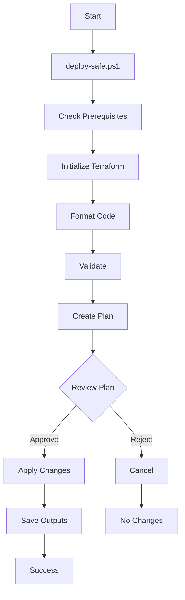

# Quick Start: Idempotent & Secure Terraform

## 🚀 What's New

Your Terraform code has been enhanced with:

1. **Idempotency**: Resources check if they exist before creation
2. **Security**: Sensitive variables, validation, and safe defaults
3. **Safety**: Lifecycle rules, preconditions, and validation checks
4. **Feature Flags**: Enable/disable modules without deleting code

## 📋 Quick Commands

### Development (Recommended)
```powershell
# Navigate to environments directory
cd terraform/environments

# Safe deployment with interactive confirmation
./deploy-safe.ps1 -Environment dev

# Plan only (no changes)
./deploy-safe.ps1 -Environment dev -PlanOnly

# Enable debug logging
./deploy-safe.ps1 -Environment dev -EnableDebug
```

### Manual Steps (Traditional Way)
```powershell
cd terraform/environments

# 1. Format code
terraform fmt -recursive

# 2. Initialize
terraform init

# 3. Validate
terraform validate

# 4. Plan
terraform plan -out=tfplan -var-file=terraform.tfvars

# 5. Review plan
terraform show tfplan

# 6. Apply (from plan file - idempotent)
terraform apply tfplan

# 7. Cleanup
rm tfplan
```

## 🎯 New Features Explained

### 1. Skip Existing Resources (Idempotency)

**Before**: Terraform would error if a catalog already existed.

**Now**: Terraform checks first and skips existing resources.

```hcl
# In terraform.tfvars
skip_existing_resources = true  # Default: skip if exists
```

To force Terraform to manage existing resources:
```hcl
skip_existing_resources = false  # Take over existing resources
```

### 2. Feature Flags (Module Control)

Enable/disable entire modules without deleting code:

```hcl
# terraform.tfvars
enable_catalog_management = true   # Deploy catalogs/schemas
enable_volume_management   = true   # Deploy volumes
```

Example: Skip volume deployment:
```hcl
enable_volume_management = false
```

### 3. Environment Safety Controls

Different behaviors for dev vs. production:

```hcl
# dev: allows force_destroy, no prevent_destroy
environment_name = "dev"

# prod: disables force_destroy, enables prevent_destroy
environment_name = "prod"
```

### 4. Input Validation

Automatic validation prevents errors:

```bash
# ❌ This will fail validation:
databricks_workspace_host = "adb-123.azuredatabricks.net"  # Missing https://

# ✅ This passes:
databricks_workspace_host = "https://adb-123.azuredatabricks.net"
```

Catalog name validation:
```bash
# ❌ Invalid:
catalogs = {
  my-catalog = { name = "MY-CATALOG" }  # Uppercase not allowed
}

# ✅ Valid:
catalogs = {
  my_catalog = { name = "my_catalog" }  # Lowercase + underscores
}
```

## 🔒 Security Improvements

### Sensitive Variables

These variables are now marked sensitive (won't appear in logs):

- `databricks_workspace_host`
- `databricks_account_id`
- `subscription_id`

### Secure State Backend

Configure remote state (optional but recommended):

```powershell
# Create backend config file
@"
resource_group_name  = "rg-terraform-state"
storage_account_name = "sttfstatedbxaml"
container_name       = "tfstate"
key                  = "databricks-uc.tfstate"
"@ | Out-File -FilePath backend.conf -Encoding UTF8

# Initialize with backend
terraform init -backend-config=backend.conf
```

## 📊 Validation Checks

New runtime checks prevent common errors:

### Check 1: Workspace Accessible
```
Error: Cannot access Databricks workspace metastore.
Verify:
1. Azure CLI authentication: az account show
2. Network connectivity to workspace
3. databricks_workspace_host is correct
```

**Fix**: Run `az login` and verify workspace URL

### Check 2: Catalog Names Valid
```
Error: Catalog names must be 3-255 characters, lowercase letters, 
numbers, and underscores only.
```

**Fix**: Use only `[a-z0-9_]` in catalog names

### Check 3: No Duplicate Catalogs
```
Error: Duplicate catalog names detected. Each catalog must have 
a unique name.
```

**Fix**: Ensure all catalog names are unique

## 🛡️ Lifecycle Protection

Resources now have lifecycle rules to prevent accidents:

### Prevent Destroy (Production)
```hcl
# Set prevent_destroy = true in production
# This prevents accidental deletion via Terraform
```

### Ignore Changes
```hcl
# Ignore manual changes made in Databricks UI:
lifecycle {
  ignore_changes = [
    properties,  # Custom properties
    owner,       # If managed outside Terraform
  ]
}
```

## 📝 Example: Deploy Development Environment

```powershell
# 1. Navigate to terraform
cd d:\Databricks\dbx-demos\Azure-Databricks-AzureML\terraform\environments

# 2. Review your terraform.tfvars
Get-Content terraform.tfvars

# 3. Run safe deployment
./deploy-safe.ps1 -Environment dev

# 4. Review the plan when prompted
# Type 'yes' to apply or 'no' to cancel
```

## 📝 Example: Production Deployment

For production, use more conservative settings:

```hcl
# prod.tfvars
environment_name            = "prod"
skip_existing_resources     = true   # Don't touch existing resources
enable_catalog_management   = true
enable_volume_management    = true

catalogs = {
  prod_main = {
    name    = "prod_main"
    comment = "Production catalog"
    schemas = {
      gold = {
        name    = "gold"
        comment = "Production gold layer"
      }
    }
  }
}
```

Deploy:
```powershell
./deploy-safe.ps1 -Environment prod -VarFile prod.tfvars
```

## 🔄 Handling Existing Resources

### Scenario 1: Catalog Already Exists

**Before enhancement**:
```
Error: resource already exists
```

**Now** (with `skip_existing_resources = true`):
```
✓ Catalog 'main' already exists, skipping creation
```

### Scenario 2: Import Existing Resources

If you want Terraform to manage existing resources:

```powershell
# 1. Set flag to false
# terraform.tfvars
skip_existing_resources = false

# 2. Import the resource
terraform import 'module.uc_catalogs.databricks_catalog.this["main"]' main

# 3. Run plan to verify
terraform plan
```

## 🐛 Troubleshooting

### Issue: Plan shows unexpected changes

**Solution**: Check lifecycle ignore_changes
```bash
# Review what fields are ignored
terraform state show 'module.uc_catalogs.databricks_catalog.this["main"]'
```

### Issue: Metastore validation fails

**Error**: "Metastore storage account must have HNS enabled"

**Solution**: Enable hierarchical namespace on storage account
```bash
az storage account update \
  --name <storage_account> \
  --resource-group <rg> \
  --enable-hierarchical-namespace true
```

### Issue: Workspace not accessible

**Error**: "Cannot access workspace metastore"

**Solution**: Check authentication
```bash
# Verify Azure login
az account show

# Verify correct subscription
az account set --subscription <subscription_id>

# Test Databricks API
az account get-access-token --resource=2ff814a6-3304-4ab8-85cb-cd0e6f879c1d
```

### Issue: Catalog name validation fails

**Error**: "Catalog name 'My-Catalog' is invalid"

**Solution**: Use only lowercase, numbers, and underscores
```hcl
# ❌ Wrong: 
name = "My-Catalog"

# ✅ Right:
name = "my_catalog"
```

## 📚 Additional Resources

- **Full Best Practices**: [BEST-PRACTICES.md](./BEST-PRACTICES.md)
- **Terraform Docs**: [terraform/README.md](../README.md)
- **Deployment Process**: [../../docs/DEPLOYMENT-PROCESS.md](../../docs/DEPLOYMENT-PROCESS.md)

## 🎓 Key Takeaways

1. ✅ **Always use `deploy-safe.ps1`** for deployments
2. ✅ **Review plans before applying** (never use -auto-approve locally)
3. ✅ **Use `skip_existing_resources = true`** for idempotency
4. ✅ **Set `environment_name`** correctly (dev/staging/prod)
5. ✅ **Enable validation** (don't use -SkipValidation)
6. ✅ **Keep plan files** for audit trail (saved in logs)
7. ✅ **Use feature flags** to disable modules temporarily
8. ✅ **Test in dev** before deploying to production

## 🚦 Workflow Summary



## 📞 Need Help?

Check these files for reference:
- `BEST-PRACTICES.md` - Comprehensive guide
- `validation.tf` - See all validation rules
- `backend.tf` - Remote state configuration
- `deploy-safe.ps1` - Safe deployment script

Happy Terraforming! 🚀
